# 表情包文件命名规则
在上传表情包时请务必遵循以下文件命名规则。**文件名中不应包含任何特指人名。** 重命名时切勿更改文件后缀名。
1. 以图片中已有的文字命名；
(1) 图片中含有标点符号的，标点符号也出现在文件名中；
(2) 图片中含有特殊符号的，忽略特殊符号；
(3) 图片中包含换行（非主副标题）的，忽略换行；
(4) 图片中包含主副标题的，取主标题或取不易与其他图片重名的标题；
(5) 图片中包含空格的，忽略空格。

|示例图片|文件名|
| :----: |  :----: |
| 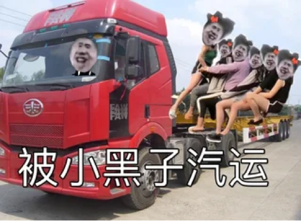 | 被小黑子汽运.png |
| 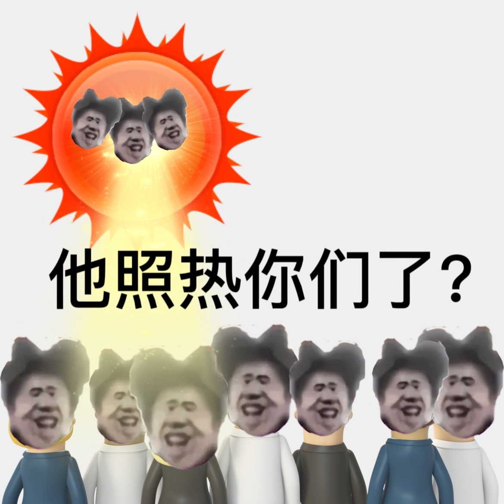 | 他照热你们了？.jpg |
|  | 我做不到与狮豹者和解.jpg |
| 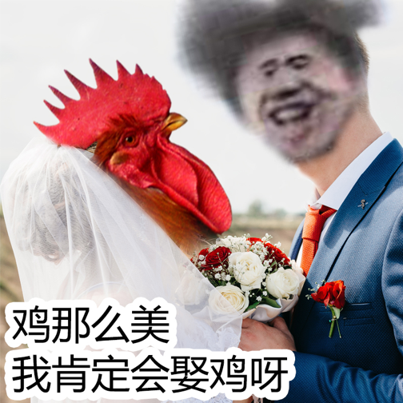 | 鸡那么美我肯定会娶鸡呀.png |
|  | 黑鸡铠甲，合体.jpg |
|  | 西天取鸡.jpg |
| 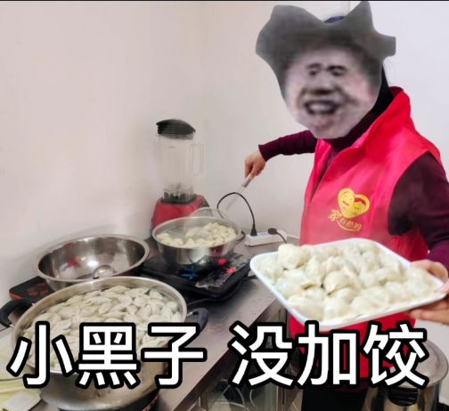 | 小黑子没加饺.jpg |

2. 图片中没有文字，以图片中有明显特征性且不易与其他图片重名的元素名称或动作命名；

|示例图片|文件名|
| :----: |  :----: |
| 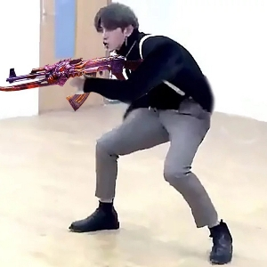 | 射击.jpg |
| 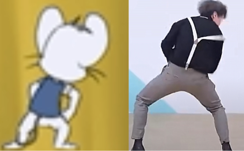 | 米可.png |
| 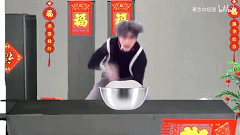 | 制面.gif |
| 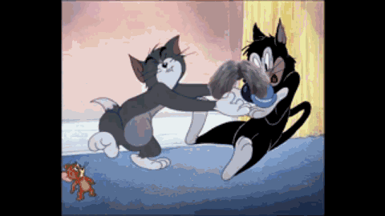 | 汤姆和布奇.gif |

3. 其他命名：难以根据以上两点命名的，以不易与其他图片重名的原则，酌情命名；

|示例图片|文件名|
| :----: |  :----: |
| 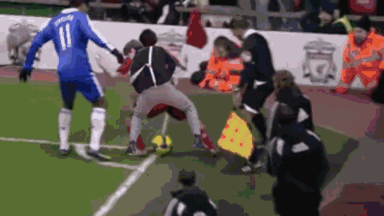 | 铁山靠与足球.gif |
| 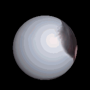 | 球状.gif |
| 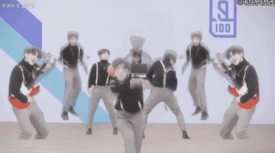 | 多才多艺.gif |
| 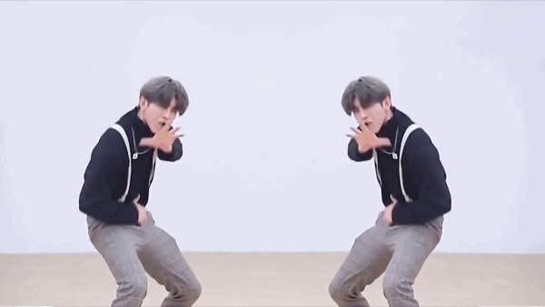 | 左右摇摆.gif |

4. 不可避免遇到重名的，请在文件名后加上数字序号，例如 A**1**.jpg 。

